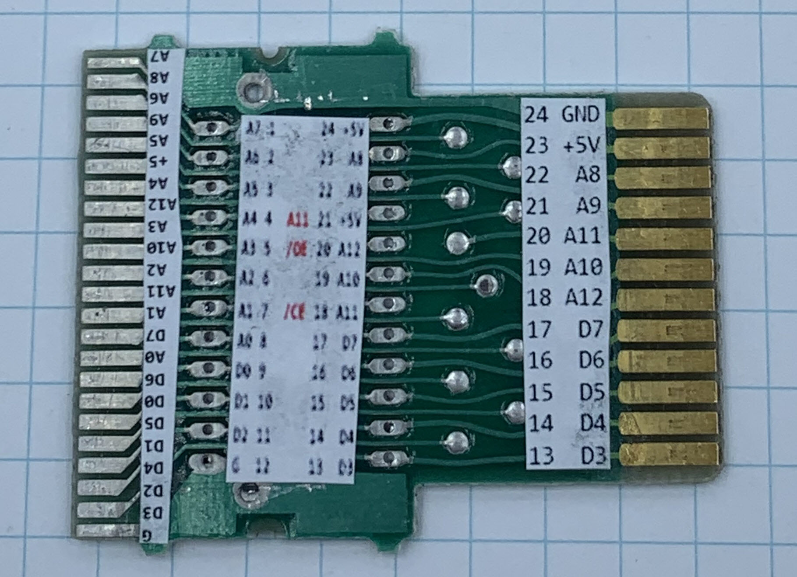

# Making your own Atari 2600 Cartridge

The simple Atari 2600 system schematics:

There are many flavors of cartridges for the Atari 2600. Many games used
bank switching for extra RAM and ROM in the cartridge. 

The earlier cartridges were simple. The `Combat` game uses a single 2K ROM chip.

The ROM chip is very similar to a standard EPROM pinout, but the Atari 2600 needs for the
ROM to be active-high chip-select where a standard EPROM is active-low chip-select. Atari
fabricated its own ROM chips to save an inverter chip in the cartridge.

The hack here involves removing the existing ROM chip and placing a DIP socket for a 2K
or 4K EPROM. The needed inverter is glued to the back of the PC board.

First, I desoldered the ROM chip from the 2K Combat board. I printed a pin label using 
Microsoft Word and glued it to the board:

Notice that the contact for A11 is missing. 4K boards have this pad. 4K is as big as the ROM
can be without bank-switching hardware, which is built into the 8K ROM of games like Asteroids. 
Here are both sides of the labeled 2K board:

Next, I switched to a 4K cartridge (Missile Command). I removed the ROM chip as before.

This cartridge PCB includes an additional card-edge connector with all the signals. Was this compatible 
with other Atari systems so that they could sell the board in another form factor that uses the other side?

I made a label for the 4K EPROM socket. I also labeled the traces at the end of the board for
future use.

Next, I glued the 7404 hex inverter to the bottom of the PCB. You can see the black ground wire
and red 5V wire powering the chip. I cut the trace feeding 5V to pin 21 of the old Atari ROM chip.
The cut is near the red wire in the picture.

The yellow wire is the A12 signal from the Atari2600. I had to peel part of the label off to get to a solder 
pad for it. This signal goes to the inverter then through the orange wire to the /0E (pin 20) of the EPROM. When 
A12 is high, the EPROM is selected. 

Why A12? The Atari2600 uses is a reduced pin-count chip CPU -- the 6507. It has no A13, A14, or A15. A12 is the top 
dog on the address bus.

I cut the old trace for A11. You can see the cut near the orange wire

You see another black wire grounding the /CS (pin 18) of the EPROM.

I soldered a DIP socket to the front of the PCB.

I cut a square window the cartridge case. I can remove/program/reinstall the
EPROM through this window.

# The DoubleGap Game

I burned my DoubleGap game into the EPROM:

https://www.youtube.com/watch?v=xcmxLo47WdA

Play it online:

https://javatari.org/?ROM=https://github.com/topherCantrell/retro-Atari2600/blob/master/DoubleGap.bin?raw=true
